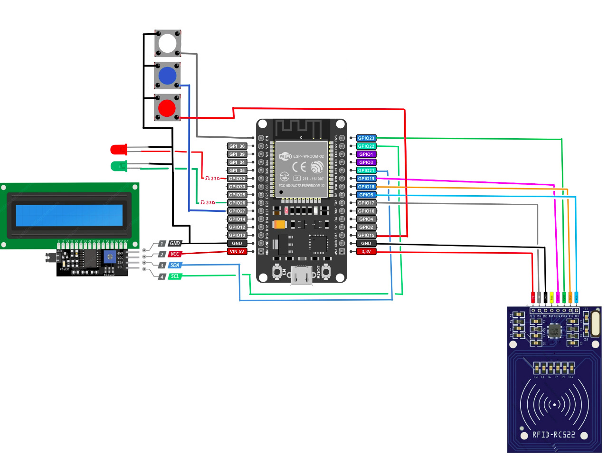

# SGPO

---

**Sistema Gerenciador de Passagens de ônibus**

A ideia do sistema surgiu com o pensamento de facilitar passageiros de ônibus a visualizar a quantidade de passagens que possui, empresas de ônibus utilizam um cartão RFID com uma passagem única ou cartões recarregáveis e pensando em passageiros que utilizam cartões recarregáveis o sistema surgiu. De acordo com pesquisas realizadas pelos desenvolvedores do sistema, a maior parte dos participantes de pesquisas do Google forms acreditam que o sistema facilitará a utilização de cartões em ônibus. O principal objetivo do sistema é criar uma página web que será acessada pelo usuário, e nessa página web através do login que será distribuído pelo administrador sera possível ver as informações de seu cadastro como nome, ID, tipo de acesso e a quantidade de passagens, além de poder ver o horário dos ônibus.

